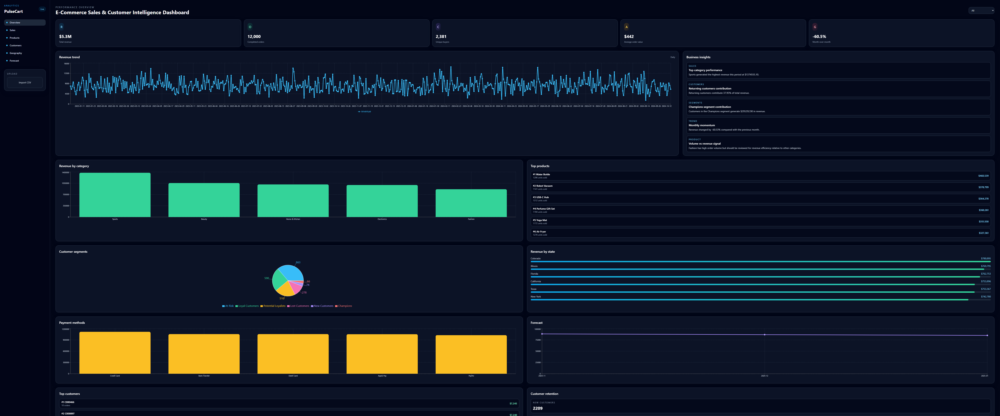

# E-Commerce Sales & Customer Intelligence Dashboard

A production-style analytics project that combines a FastAPI backend, SQLite-powered data layer, and a React + Tailwind dashboard to analyze e-commerce sales performance, customer behavior, product performance, geography, and demand forecasting.

## Dashboard Preview



## Project Overview

This dashboard is designed to help business stakeholders answer practical questions such as:

- Which products drive the most revenue?
- How are sales trending over time?
- Which customer segments are most valuable?
- Which regions perform best?
- What will revenue likely look like in the next quarter?

The system loads a realistic synthetic e-commerce dataset, stores it in SQLite, calculates analytics using Pandas and NumPy, and exposes the results through a REST API for a polished React frontend.

## Business Problem

E-commerce teams often need a unified view of sales quality, customer retention, and operational performance. Without a data-driven dashboard, teams rely on fragmented spreadsheets and inconsistent KPI reporting.

This project solves that by turning raw order data into:

- Executive KPI summaries
- Customer lifecycle insights
- Product and category analysis
- Geographic demand insights
- Revenue forecasting
- Automatic business commentary

## Key Features

- Upload a CSV transaction file with validation
- SQLite-backed transactional data layer
- KPI dashboard with revenue, order, customer, and growth metrics
- Sales trend analysis by day and month
- Product and category performance analysis
- RFM analysis and customer segmentation
- Geographic revenue and order summaries
- Payment mix and revenue by payment method
- 3-month revenue forecast
- Dynamic business insights generated from actual data
- React dashboard with responsive layout and interactive charts

## Architecture

```text
+------------------+      REST API       +-------------------+
| React Dashboard  | <-----------------> | FastAPI Backend   |
| Vite + Tailwind  |                    | SQLite + Pandas   |
+------------------+                    +-------------------+
                                                 |
                                                 v
                                      Analytics Engine
                                      - RFM Analysis
                                      - K-Means Segments
                                      - Forecasting
                                      - Insights
```

## Tech Stack

### Backend
- Python 3.11+
- FastAPI
- Pandas
- NumPy
- Scikit-learn
- SQLite
- Pydantic
- Uvicorn

### Frontend
- React
- Vite
- JavaScript
- Tailwind CSS
- Recharts

## Dataset Description

The backend uses a synthetic e-commerce dataset with more than 10,000 transaction records across multiple product categories, cities, states, and payment methods. If `backend/data/ecommerce_data.csv` is missing, the backend generates it on startup and loads it into SQLite. The generated CSV and local SQLite database are excluded from Git.

Required columns:
- order_id
- customer_id
- order_date
- product_id
- product_name
- category
- quantity
- unit_price
- discount
- revenue
- city
- state
- payment_method
- customer_type

The generated data mimics retail behavior and is ready to use without a separate download.

## Analytics Methodology

The application performs data cleaning, aggregation, and calculation using Pandas and NumPy.

Key analytical logic includes:
- Revenue aggregation by period and category
- KPI calculations from transaction records
- Customer-level metric summary
- Product rankings by revenue and quantity
- Geographic aggregation by city and state
- Payment method analysis
- Revenue momentum and YoY/month-over-month growth assessment
- Forecasting based on past monthly revenue patterns

## RFM Methodology

RFM stands for Recency, Frequency, and Monetary value.

- Recency: how recently a customer placed an order
- Frequency: how many orders a customer placed
- Monetary: total revenue generated by the customer

Customers are assigned scores and then classified into segments such as:
- Champions
- Loyal Customers
- Potential Loyalists
- New Customers
- At Risk
- Lost Customers

This enables retention-focused business analysis and prioritization.

## K-Means Methodology

Customer segmentation uses K-Means clustering on customer-level features such as:
- total revenue
- order frequency
- average order value
- recency

The algorithm groups customers into clusters that describe behavioral patterns and revenue contribution. Cluster characteristics are summarized so business stakeholders can interpret the customer base more easily.

## API Documentation

The backend exposes the following endpoints:

- GET /api/dashboard/summary
- GET /api/sales/trend
- GET /api/products/top
- GET /api/products/categories
- GET /api/customers/summary
- GET /api/customers/rfm
- GET /api/customers/segments
- GET /api/geography
- GET /api/payments
- GET /api/forecast
- GET /api/insights
- POST /api/upload

## Installation Instructions

### 1. Open the project folder

```bash
cd ecommerce-analytics-dashboard
```

### 2. Install backend dependencies

Windows PowerShell:
```bash
cd backend
py -3.11 -m venv venv
.\venv\Scripts\Activate.ps1
python -m pip install -r requirements.txt
```

### 3. Install frontend dependencies

```bash
cd frontend
npm install
```

## How to Run Backend

```bash
cd backend
venv\Scripts\Activate.ps1
uvicorn app.main:app --reload
```

The API will be available at:
- http://localhost:8000
- Swagger docs: http://localhost:8000/docs

## How to Run Frontend

```bash
cd frontend
npm run dev
```

The dashboard will be available at:
- http://localhost:5173

## Deploy to Render

The repository includes a `render.yaml` Blueprint that creates a FastAPI web service and a static React site. The API service stores its SQLite database on a persistent disk mounted at `/var/data`; the frontend gets the API host from the backend service configuration.

1. Push this repository to GitHub.
2. In Render, choose **New** > **Blueprint** and connect this repository.
3. Review the two services and deploy the Blueprint.

After the deploy completes, open the `ecommerce-analytics-dashboard` static site URL. The backend API and interactive API documentation are available at the `ecommerce-analytics-api` service URL and its `/docs` path.

The persistent disk is required to retain uploaded CSV data across service restarts. The included disk is 1 GB; adjust `sizeGB` in `render.yaml` if needed.

## Example API Requests

### Summary
```bash
curl http://localhost:8000/api/dashboard/summary
```

### Sales Trend
```bash
curl http://localhost:8000/api/sales/trend
```

### Forecast
```bash
curl http://localhost:8000/api/forecast
```

### Upload CSV
```bash
curl -X POST "http://localhost:8000/api/upload" -F "file=@your_data.csv"
```

## Future Improvements

- Add user authentication and role-based access
- Add multi-filter dashboard controls for date ranges and channels
- Extend forecasting with SARIMA or Prophet
- Add anomaly detection for unexpected sales activity
- Add export features for Excel and CSV
- Add more advanced cohort and retention analysis

## Key Data Analyst Skills Demonstrated

- Data cleaning
- Exploratory Data Analysis
- Data aggregation
- SQL
- KPI development
- Customer segmentation
- RFM analysis
- K-Means clustering
- Trend analysis
- Forecasting
- Data visualization
- Business insights

---

This project was built to demonstrate real-world analytics workflows and data storytelling capabilities in a portfolio-ready format.
